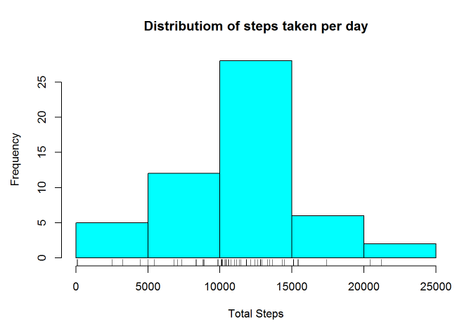
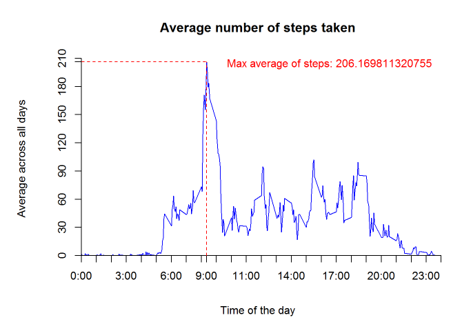
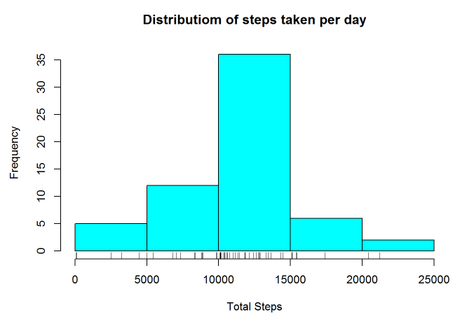
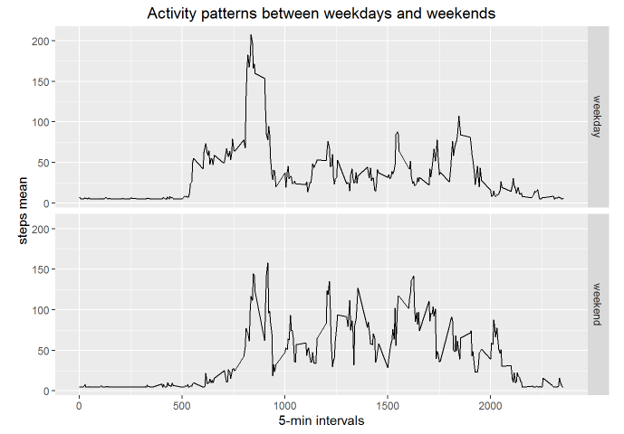

# Reproducible Research: Assignment Project 1


## Loading and preprocessing the data


Show any code that is needed to 

1. Load the data (i.e. read.csv())

```{r}
setwd("C:/Users/Dell/Documents/R")
act <- read.csv("activity.csv")
```


2. Process/transform the data (if necessary) into a format suitable for your analysis

```{r}
str(act)
```

# What is mean total number of steps taken per day?

For this part of the assignment, you can ignore the missing values in the dataset.

1. Make a histogram of the total number of steps taken each day

```{r}
act1 <- act[!is.na(act[,1]),]
library(plyr)
act2 <- ddply(act1, "date", summarize, tot.steps.by.day=sum(steps))
hist(act2[,2],breaks=5, main="Distributiom of steps taken per day", xlab="Total Steps", col="cyan")
rug(act2[,2])
```
 

2. Calculate and report the mean and median total number of steps taken per day

```{r}
m <- mean(act2[,2])
md <- median(act2[,2])
paste("mean:", m)
paste("median:", md)
```
1. [1] "mean: 10766.1886792453"
2. [1] "median: 10765"

## What is the average daily activity pattern?

1. Make a time series plot (i.e. type = "l") of the 5-minute interval (x-axis) and the average number of steps taken, averaged across all days (y-axis)

2. Which 5-minute interval, on average across all the days in the dataset, contains the maximum number of steps?


```{r}
timeSeries <- ddply(act1, "interval", summarize, mean.steps.by.interval=mean(steps))
plot(timeSeries, type = "l", axes = F, xlab = "Time of the day", ylab = "Average across all days", main = "Average number of steps taken", col = "blue")
max <- which.max(timeSeries$mean.steps.by.interval)
axis(1,at=c(seq(0,2400,100),timeSeries[max,1]), label = paste(c(seq(0,24,1),9),c(rep(":00",25),":00"),sep=""), pos = 0)
axis(2, at=c(seq(0,210,30),timeSeries[max,2]), label = c(seq(0,210,30),timeSeries[max,2]), pos = 0)
segments(timeSeries[max,1], 0, timeSeries[max,1], timeSeries[max,2], col = "red", lty = "dashed")
text(timeSeries[max,1],200, paste("Max average of steps:",timeSeries[max,2]), col = "red", adj = c(-.1, -.1))
segments(0, timeSeries[max,2], timeSeries[max,1], timeSeries[max,2], col = "red", lty = "dashed")
```

 

## Imputing missing values

Note that there are a number of days/intervals where there are missing values (coded as NA). The presence of missing days may introduce bias into some calculations or summaries of the data.

1. Calculate and report the total number of missing values in the dataset (i.e. the total number of rows with NAs)

```{r}
paste("Number of missing observations in activity dataset =", length(act[is.na(act[,1]),1]))
```
1. [1] "Number of missing observations in activity dataset = 2304"

2. Devise a strategy for filling in all of the missing values in the dataset. The strategy does not need to be sophisticated. For example, you could use the mean/median for that day, or the mean for that 5-minute interval, etc.

```{r}
"My strategy will be filling in the missing observations with the mean value of the sample."
```

1. [1] "My strategy will be filling in the missing observations with the mean value of the sample."

3. Create a new dataset that is equal to the original dataset but with the missing data filled in.

```{r}
newact <- act
newact[is.na(newact[,1]),1] <- mean(act[!is.na(act[,1]),1])
```

4. Make a histogram of the total number of steps taken each day and Calculate and report the mean and median total number of steps taken per day. Do these values differ from the estimates from the first part of the assignment? What is the impact of imputing missing data on the estimates of the total daily number of steps?

```{r}
newact2 <- ddply(newact, "date", summarize, tot.steps.by.day=sum(steps))
hist(newact2[,2],breaks=5, main="Distributiom of steps taken per day", xlab="Total Steps", col="cyan")
rug(act2[,2])
m <- mean(newact2[,2])
md <- median(newact2[,2])
paste("mean:", m)
paste("median:", md)
```

 

```{r}
"Filling in the missing observations with the mean value of the sample didn't apparantly seems to bias the estimates. Anyway, in this case the mean and the median got the same value (10766.1886792453). When not considerign missing values the mean and the median where very close but not equal (10766.1886792453 x 10765). In this case the impact of imputing missing data was almost none to the estimates of total daily number of steps."
```

1. [1] "Filling in the missing observations with the mean value of the sample didn't apparantly seems to bias the estimates. Anyway, in this case the mean and the median got the same value (10766.1886792453). When not considerign missing values the mean and the median where very close but not equal (10766.1886792453 x 10765). In this case the impact of imputing missing data was almost none to the estimates of total daily number of steps."

## Are there differences in activity patterns between weekdays and weekends?

For this part the weekdays() function may be of some help here. Use the dataset with the filled-in missing values for this part.

1. Create a new factor variable in the dataset with two levels - "weekday" and "weekend" indicating whether a given date is a weekday or weekend day.

```{r}
newact1 <- newact
Sys.setlocale("LC_TIME","English")
newact1$date <- as.Date(newact1$date, "%Y-%m-%d")
newact1$weekday.name <- weekdays(newact1$date)
newact1$day.type <- c("weekday")
for (i in 1:nrow(newact1)){
  if (newact1$weekday.name[i] == "Saturday" || newact1$weekday.name[i] == "Sunday"){
    newact1$day.type[i] <- "weekend"
  }
}
newact1$day.type <- as.factor(newact1$day.type)
```

2. Make a panel plot containing a time series plot (i.e. type = "l") of the 5-minute interval (x-axis) and the average number of steps taken, averaged across all weekday days or weekend days (y-axis). The plot should look something like the following, which was creating using simulated data:
Your plot will look different from the one above because you will be using the activity monitor data. Note that the above plot was made using the lattice system but you can make the same version of the plot using any plotting system you choose.

```{r}
weekDayOrWeekEnd <- aggregate(steps ~ interval+day.type, newact1, mean)
library(ggplot2)    
p <- qplot(interval, steps, data=weekDayOrWeekEnd, geom=c("line"), xlab="5-min intervals", ylab="steps mean", main="Activity patterns between weekdays and weekends")
p + facet_grid(day.type ~ .)
```

 


